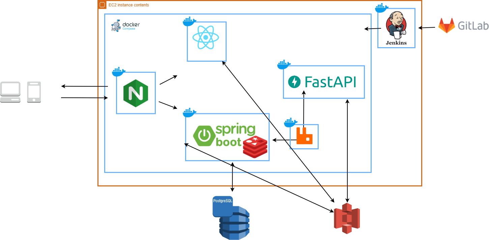

# 🌌 Would You Draw

### *우주 드로우 – 감정을 별로 기록하는 우주 감정 아카이브*

> 하루의 감정은 하나의 별이 되고
> 7일이 모이면 별자리가 되며
> 30일이 되면 나만의 은하가 된다.

---

## 🚀 프로젝트 소개

Would You Draw (우주 드로우)는
사용자가 감정을 **그림으로 표현**하면
AI가 객체 기반 분석을 수행하고
그 감정이 우주 공간에 시각적으로 기록되는
감정 드로잉 PWA 서비스입니다.

감정은 점수가 아니라
**시간에 따라 확장되는 우주 구조**입니다.

---

## 🌠 우주 구조 시스템

| 단위        | 의미    |
| --------- | ----- |
| ⭐ Day 1   | 감정의 별 |
| 🌌 Day 7  | 별자리   |
| 🌠 Day 30 | 은하계   |

* 감정은 색으로 표현됩니다.
* 감정 기록은 사라지지 않고 우주에 남습니다.

---

# 🧠 핵심 기능

## 1️⃣ Daily 감정 드로잉

* 오늘의 감정 선택 (5~8 감정 마스터 기반)
* 자유 드로잉
* 감정 일기 작성
* AI 간단 해석 제공
* 감정 색상 기반 별 생성

---

## 2️⃣ Deep (심층 드로잉)

심층 드로잉은 3가지 유형으로 구성됩니다.

---

### 🏠 HTP (House-Tree-Person)

* 집 / 나무 / 사람 단계별 드로잉
* 상징 구조 기반 객체 탐지
* 단계별 질문 제공
* 통합 내면 해석

---

### 🌧️ 빗속의 사람 그림

* 비 + 인물 + 보호 요소(우산 등) 분석
* 스트레스 대처 방식 상징 해석
* 환경 압박 대비 자아 반응 구조 분석
* AI 객체 탐지 기반 의미 도출

---

### 🌌 별바다 그림

* 자신을 우주/별/바다로 표현
* 위치, 크기, 주변 상징 요소 분석
* 자아 인식 및 감정 확장성 해석
* 우주 세계관과 연결되는 심층 콘텐츠

---

# 🛰️ 시스템 아키텍처

---

# 🧩 기술 스택

### Frontend

* React (PWA)
* Canvas 드로잉
* JWT 인증
* Oauth

### Backend

* Spring Boot
* PostgreSQL
* RabbitMQ
* AWS S3

### AI

* FastAPI
* YOLO 객체 탐지
* 상징 기반 해석 로직

### Infra 

* AWS
* Jenkins CI/CD
* Docker
* Nginx
* Presigned URL 업로드 구조
* RabbitMQ 기반 비동기 분석

---

# 🎯 서비스 철학

* 감정은 진단 대상이 아니다
* AI는 판단자가 아니라 해석 보조자다
* 감정은 기록이 아니라 축적되는 우주다

